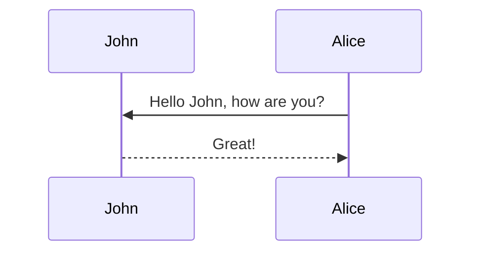

## assessment and plan

### neuro

##### epidural (Ropivacaine) and PCA

In general, it is always worth considering whether a patient needs an epidural for pain control after surgery. As Val said, it either works well, or it doesn't work at all and the patient is unnecessarily hypotensive, and you should consider using just PCA instead of epidural to begin with.

If the patient is on epidural, you want to closely monitor blood pressures to make sure they don't go hypotensive. Hypotension due to an epi is either because the epi is too deep or it's working too well. If the patient is going hypotensive, consider a split. A split is where half of pain control is through epi and the other half is through PCA. If they are still hypotensive, you'll need to pause the epi and switch to full PCA

PCA is an IV pain med and will need to be switched to something PO before discharge (usually oxy)

##### NSAIDs

Don't give NSAIDs after a total gastrectomy!

### CV

### pulm

### GI

##### getting off TPN

```mermaid
graph TD;
    A-->;
```



### GU

### heme

##### when to get pRBCs

The magic number for when to order blood transfusion is HgB < 7 (or HgB < 8 if relevant cardiac hx).

### endo

### ID

### dispo


